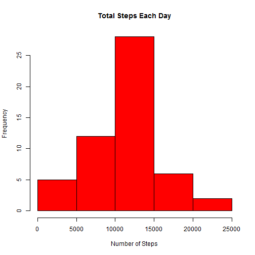
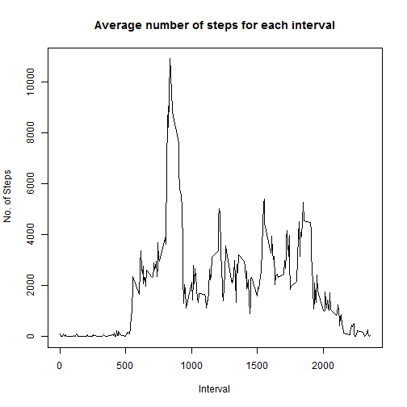
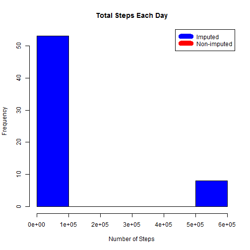

#Reproducible Research : Peer Assesment 1

## Loading the data

```r
data <- read.csv("activity.csv")
```

## What is the mean number of steps taken per day?

This part depicts the total number of steps of each day through the histogram and calculates the mean and median.

```r
stepsByDay <- aggregate(steps ~ date, data, sum)
hist(stepsByDay$steps, main = "Total Steps Each Day",col = "red",xlab = "Number of Steps")
```

 

```r
stepsMean <- mean(stepsByDay$steps)
stepsMedian <- median(stepsByDay$steps)
```
The `mean` is 'r stepsMean` and the `median` is 10765

## What is the average daily activity pattern?

This part calulcates the average steps for each interval for all day and plots this data.
It then finds the interval with most steps.


```r
stepsByInterval <- aggregate(steps ~ interval, data, sum)
plot(stepsByInterval$interval,stepsByInterval$steps,type = "l",xlab = "Interval",ylab = " No. of Steps",main = "Average number of steps for each interval")
```

 

```r
maxInterval <- stepsByInterval[which.max(stepsByInterval$steps),1]
```

The 5- minute interval,on average over all days, with maximum number of steps is 'r maxInterval`

## Input Missing Values

This part calculates and reports the number of missing values in the dataset.
In addition, it creates a new dataset with missing values being replaced by the mean of the value of that interval, for all days.


```r
incomplete <- sum(!complete.cases(data))
imputedData <- transform(data, steps = ifelse(is.na(data$steps), stepsByInterval$steps[match(data$interval, stepsByInterval$interval)], data$steps))
```

Zeroes were imputed for 10-01-2012 because it was the first day and would have been over 9,000 steps higher than the following day, which had only 126 steps. NAs then were assumed to be zeros to fit the rising trend of the data. 

```r
imputedData[as.character(imputed_data$date) == "2012-10-01", 1] <- 0
```

```
## Error: object 'imputed_data' not found
```


Recount total steps by day and create Histogram. 

```r
steps_by_day_i <- aggregate(steps ~ date, imputedData, sum)
hist(steps_by_day_i$steps, main = paste("Total Steps Each Day"), col="blue", xlab="Number of Steps")

#Create Histogram to show difference. 
hist(steps_by_day$steps, main = paste("Total Steps Each Day"), col="red", xlab="Number of Steps", add=T)
```

```
## Error: object 'steps_by_day' not found
```

```r
legend("topright", c("Imputed", "Non-imputed"), col=c("blue", "red"), lwd=10)
```

 

Calculate new mean and median for imputed data. 

```r
rmeani <- mean(steps_by_day_i$steps)
rmediani <- median(steps_by_day_i$steps)
```
* The imputed data mean is 8.4188 &times; 10<sup>4</sup>
* The imputed data median is 11458

Calculate difference between imputed and non-imputed data.

```r
mean_diff <- rmeani - stepsMean
med_diff <- rmediani - stepsMedian
```

* The difference between the non-imputed mean and imputed mean is 7.3422 &times; 10<sup>4</sup>
* The difference between the non-imputed mean and imputed mean is 693

Calculate total difference.

```r
total_diff <- sum(steps_by_day_i$steps) - sum(stepsByDay$steps)
```


* The difference between total number of steps between imputed and non-imputed data is 4564864. Thus, there were 4564864 more steps in the imputed data.


## Are there differences in activity patterns between weekdays and weekends?
Created a plot to compare and contrast number of steps between the week and weekend. There is a higher peak earlier on weekdays, and more overall activity on weekends.  

```r
weekdays <- c("Monday", "Tuesday", "Wednesday", "Thursday", 
              "Friday")
imputed_data$dow = as.factor(ifelse(is.element(weekdays(as.Date(imputedData$date)),weekdays), "Weekday", "Weekend"))
```

```
## Error: object 'imputed_data' not found
```

```r
steps_by_interval_i <- aggregate(steps ~ interval + dow, imputedData, mean)
```

```
## Error: object 'dow' not found
```

```r
library(lattice)

xyplot(steps_by_interval_i$steps ~ steps_by_interval_i$interval|steps_by_interval_i$dow, main="Average Steps per Day by Interval",xlab="Interval", ylab="Steps",layout=c(1,2), type="l")
```

```
## Error: object 'steps_by_interval_i' not found
```
